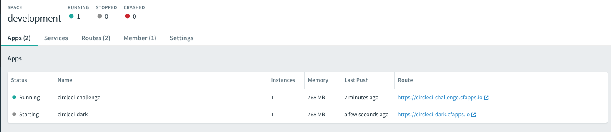

# Circle CI Demo

Build, Test and Deploy a simple webapp using CircleCI, Saucelabs and Cloud Foundry.


##  Testing
To test simple UI functionality we're using Spring Boot's test starter and SauceLabs Connect Tunnel binaries driven through Selenium's `WebDriver` interface.  The use of SauceLabs let's us run several browser combinations in parallel.

You can see these simple tests in [HomePagesTests.java](src/test/java/com/edwardawebb/circleci/demo/it/HomePageIT.java)

## Deploying on Cloud Foundry
One of my favorite features of CF is the **zero-downtime** deployments using [Blue/Green strategy](https://martinfowler.com/bliki/BlueGreenDeployment.html).

1. Push new version of app on a 'dark' URL not used by customers
1. Validate application health on dark URL
1. Begin routing customer facing URL to new version
1. Stop sending customer traffic to old version
1. Stop and remove previous version




You can see this executed in [config.yml](.circleci/config.yml#L107)

#### Viewing
And live app visible on http://blueskygreenbuilds.com


## Running locally

This project uses spring boot, so run as you would any other like project to start on port :8080 locally.

```
mvn spring-boot:run
```


# Demo
See [demo-assets](demo-assets)
